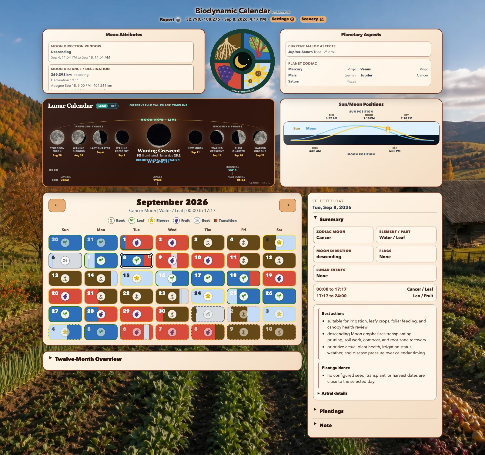
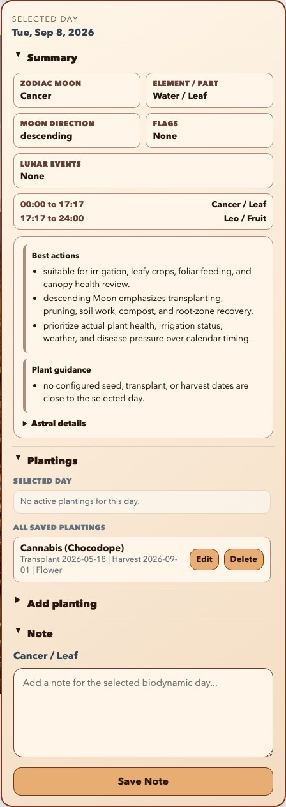
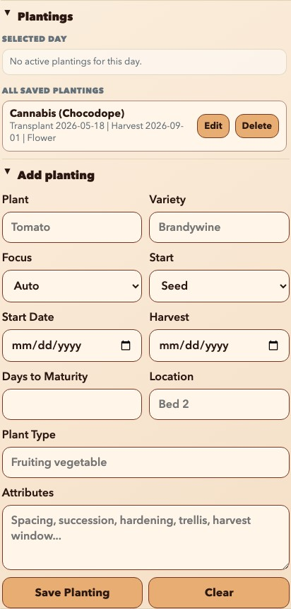
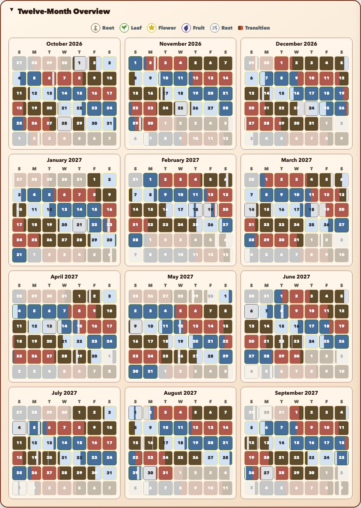
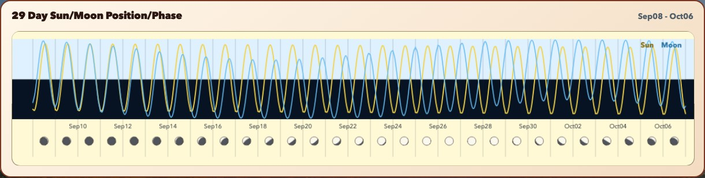
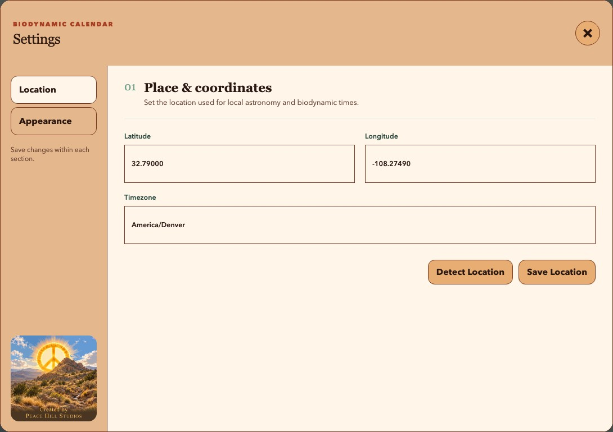
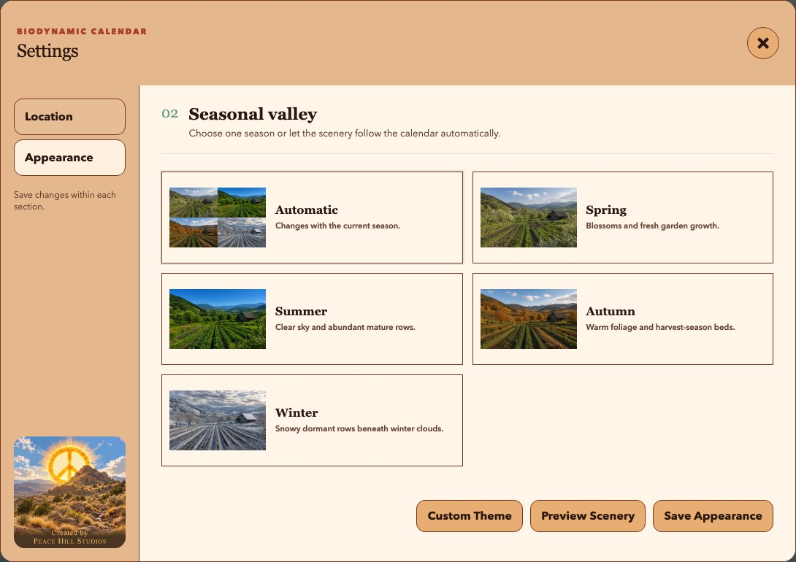
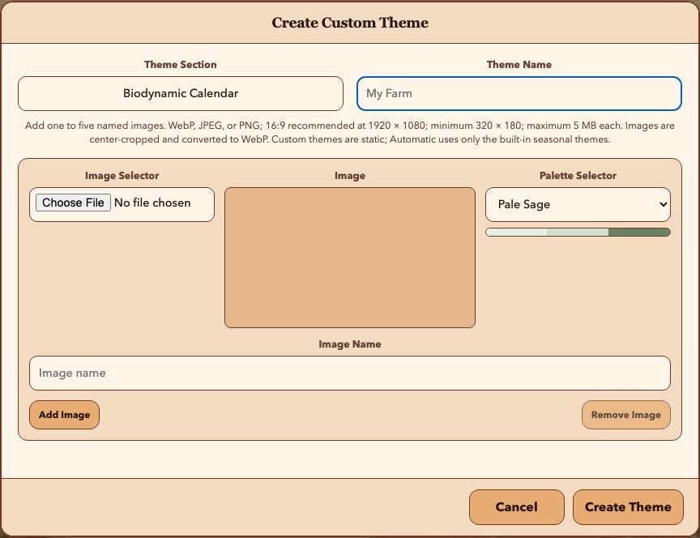
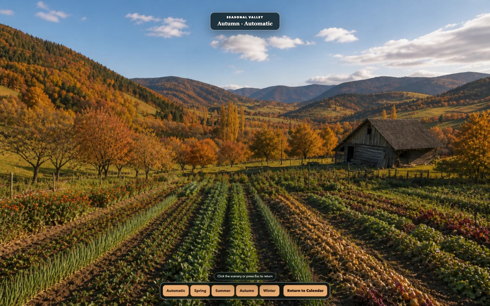

  

# Biodynamic Calendar User Guide

Biodynamic Calendar is a local-first planning dashboard that combines a Maria Thun-style biodynamic calendar, observer-local Sun and Moon information, planetary context, planting records, daily notes, and printable monthly reports.

This guide is for day-to-day users. You do not need to understand Python, FastAPI, Skyfield, or Astral to use the dashboard.

The screenshots were captured from the running app at `http://0.0.0.0:8765` on September 8, 2026, using its configured location (32.790, -108.275) and automatic seasonal appearance. Your dates, coordinates, astronomical events, season, plantings, and guidance will differ.

> Biodynamic indications are planning aids, not guarantees. Plant health, weather, soil conditions, irrigation, disease pressure, and local growing advice should take priority.

## Open Biodynamic Calendar

Start Biodynamic Calendar with the launcher created by the installer. The desktop launcher opens the app in its own resizable window. You can also use a browser:

- On the Biodynamic Calendar computer: `http://127.0.0.1:8765`
- From another device on the same trusted network: `http://<calendar-computer-LAN-IP>:8765`

The usual installed launchers are:

- macOS or Linux: `~/Biodynamic_Calendar/run_bd_calendar_gui.sh`
- Windows: `C:\Users\<name>\Biodynamic_Calendar\run_bd_calendar_gui.cmd`

The header shows the application version, **Report**, the active coordinates, the local date and time, **Settings**, and **Scenery**. The displayed time and all calendar boundaries use the configured timezone, which may differ from the timezone of the device viewing the page.

## Quickstart

1. Open **Settings**.
2. In **Location**, verify latitude, longitude, and timezone, then select **Save Location**. Select **Detect Location** if you want the server to determine them automatically.
3. Close Settings and confirm that the header coordinates and current month are correct.
4. Select a calendar day to see its biodynamic summary, time segments, and daily guidance.
5. Expand **Plantings** to add a crop plan, or expand **Note** to record observations for that day.

The first calculation can take longer if the Skyfield ephemeris has not yet been cached. Initial setup and the first ephemeris download require internet access; routine calculations are local after the required data is present.

## Dashboard Overview

The desktop dashboard has an astronomy area across the top, the month calendar below it, and a selected-day inspector on the right. Narrow screens stack these areas vertically without removing any functions.

### Header Controls

- **Report** prepares the displayed month as a print-friendly report and opens it in a new browser tab or window.
- **Coordinates** identify the location used for astronomy and biodynamic timing.
- **Date and time** use the configured timezone.
- **Settings** opens the Location and Appearance dialog.
- **Scenery** hides the working panels and displays the current seasonal valley background.

### Moon Now and Lunar Cycle

The wide **Lunar Calendar** panel shows the current phase in the center, the four previous phase milestones to its left, and the four upcoming phase milestones to its right. Each milestone includes its observer-local date, and full moons use their traditional monthly name. The center summary includes illuminated percentage, lunar day, observer-local orientation, and Moon altitude.

The two timelines along the bottom cover one observer-local solar day, from sunrise through sunset to the next sunrise. Moonrise and Moonset are placed proportionally on the same interval, including an event after midnight when it occurs before the next sunrise.

- **Local** draws the Moon as oriented for the configured observer, including bright-limb direction and surface rotation. An altitude below zero means the Moon is below that observer's horizon.
- **Ref** changes the disks to a conventional phase-diagram orientation. It does not change any calendar calculation.

Moonrise or Moonset may be unavailable on a particular local date at high latitudes. A dash means no usable value was calculated for that item.

Select the lunar-cycle panel to open the 29-day Sun/Moon graphic.

### Sun/Moon Positions

The **Sun/Moon Positions** panel plots approximate altitude through a 24-hour local day. Yellow represents the Sun and blue represents the Moon. Labels mark sunrise, solar noon, sunset, Moonrise, and Moonset when those events occur on the selected local date.

The curve is a day overview, not a compass bearing. Select the panel to open the same 29-day position and phase view available from the Moon panel.

### Moon Attributes

The **Moon Attributes** panel provides additional planning context:

- **Moon Direction Window** shows whether the Moon is currently ascending or descending and the time span of that window.
- **Moon Distance / Declination** shows the current Earth-Moon distance, whether the Moon is approaching or receding, declination, and nearby apogee/perigee events.
- **Eclipses** lists upcoming lunar eclipse information when available.

Ascending and descending Moon describe the Moon's changing declination, not waxing and waning. They are separate cycles.

### Planetary Aspects

The **Planetary Aspects** panel lists major aspects currently within the dashboard's displayed orb and the zodiac positions of Mercury, Venus, Mars, Jupiter, and Saturn. An orb is the angular distance from an exact aspect. If no qualifying aspect is present, the panel says so.

Planetary information is contextual. It does not replace the Moon-sign, plant-part, or off-period indications in the month calendar.

## Month Calendar

The month heading contains previous and next arrows. The summary beneath it shows the Moon sign, element, plant part, and active time window at the moment represented by the current payload.

Each day cell uses color and an icon to show its dominant plant-part emphasis:

- **Root**: Earth signs; root and below-ground development.
- **Leaf**: Water signs; leaf and vegetative development.
- **Flower**: Air signs; flowers and blooming plants.
- **Fruit**: Fire signs; fruits, seeds, and fruiting crops.
- **Rest**: a node or perigee off-period dominates the day or segment.
- **Transition**: more than one influence occurs during the local day; the cell is divided by time.

The dominant label is only a summary. Select the day and read its time segments before scheduling work, especially when a cell contains multiple colors.

Additional marks identify saved information:

- A note marker means the day has a saved note.
- Planting start and harvest outlines mark dates from saved planting plans.
- The currently selected date has a stronger selection outline.
- Days outside the displayed month are muted but remain selectable.

Use the previous and next arrows to move one month at a time. Selecting an adjacent-month day or a day in the twelve-month overview moves the main calendar to that month and selects the date.

## Selected Day Inspector

The inspector updates whenever you select a day.

### Summary

The top facts show the dominant zodiac Moon, element and plant part, ascending or descending Moon direction, flags, and lunar events. The segment list gives exact local start and end times for each Moon-sign or off-period segment.

Daily guidance is grouped into:

- **Best actions**: practical suggestions that fit the day's influences.
- **Cautions**: conflicts, off-periods, or conditions that deserve restraint.
- **Plant guidance**: timing advice related to saved planting plans.
- **Astral details**: expandable technical detail behind the summary.

Guidance is generated from the selected date and your saved plantings. It can change when a planting is added, edited, or deleted.

### Plantings

Expand **Plantings** to see crops active on the selected date and all saved planting plans. A planting is active from its start date through its expected harvest date; when no harvest date is set, it remains relevant after its start.

- **Edit** loads that planting into the editor.
- **Delete** removes it immediately from the saved list.
- **Add planting** opens a blank editor.

The planting fields are:

- **Plant**: required crop name.
- **Variety**: cultivar or variety name.
- **Focus**: Root, Leaf, Flower, Fruit, or Auto. Auto allows the app to infer a focus from the other crop information when possible.
- **Start**: Seed or Transplant.
- **Start Date**: required sowing or transplant date.
- **Harvest**: optional expected harvest date.
- **Days to Maturity**: optional value from 1 to 730 days.
- **Location**: bed, row, container, greenhouse, or other garden location.
- **Plant Type**: a descriptive category such as root vegetable or fruiting vegetable.
- **Attributes**: spacing, succession, hardening, trellis, harvest-window, or other planning details.

Select **Save Planting** to add or update the record. Select **Clear** to close the editor and discard the form's current contents. Calendar markers and daily guidance refresh after a successful save or delete.

### Notes

Expand **Note**, enter an observation or plan for the selected date, and select **Save Note**. Saving an empty note removes the note for that date. Notes are plain text and belong to one calendar date.

## Twelve-Month Overview

Expand **Twelve-Month Overview** beneath the main calendar to see the twelve months following the displayed month. The compact calendars use the same plant-part colors, transition bands, planting start markers, and harvest markers as the main calendar.

Select any mini-calendar date to make its month active in the main calendar and open that date in the inspector. The overview is intended for long-range scanning; use the main calendar and inspector for exact time segments and guidance.

The range is cached locally for faster repeat use. Changing location clears incompatible calendar cache entries, and adding or changing a planting refreshes its planning markers.

## 29-Day Sun/Moon Dialog

Select either the **Lunar Calendar** panel (containing **Moon Now · Live**) or **Sun/Moon Positions** to open the **29 Day Sun/Moon Position/Phase** overlay.

- Yellow and blue curves show the daily Sun and Moon altitude cycles.
- The light and dark halves of the chart separate positions above and below the horizon.
- The lower row shows the Moon phase for each date.
- The date range appears in the upper-right corner.

Close the overlay by selecting the graphic or its surrounding shaded area, or press Escape. The overlay does not change the selected calendar day.

## Settings

Select **Settings** in the header. Each pane saves independently. A save in one pane does not submit unsaved edits in another pane. Settings buttons have rounded corners. The dialog fits the built-in theme choices and action buttons with a small bottom margin on larger screens; smaller screens and added custom themes can still scroll. The rounded dialog header follows the selected appearance palette, and the menu pane shows save feedback above the Peace Hill Studios graphic. Close the dialog with the top-right X, Escape, or the shaded area outside the dialog.

### Location

- **Latitude** accepts -90 through 90.
- **Longitude** accepts -180 through 180.
- **Timezone** must be a valid IANA timezone such as `America/Denver`, `Europe/London`, or `Australia/Sydney`.
- **Detect Location** discards manual location values after successful detection, fills the form, saves the detected location, and reloads the calendar.
- **Save Location** validates and saves the values currently in the form.

Latitude, longitude, and timezone must describe the same place. An incorrect timezone can shift day boundaries, event times, month selection, and the meaning of "today" even when the coordinates are correct.

Automatic detection first tries IP geolocation and may fall back to compatible Sensorius settings or the system timezone city. IP-based results are approximate; verify all three fields after detection.

### Appearance

Choose one seasonal valley:

- **Automatic** follows the configured location's current calendar season.
- **Spring**, **Summer**, **Autumn**, and **Winter** keep a fixed valley background.

### Custom Themes

The five shipped appearance choices are read-only. Select **Custom Theme** to add a separate named collection containing one to five images. For each image, choose a WebP, JPEG, or PNG file, give it a display name, and select a palette for the calendar panels. Images must be at least 320 × 180 pixels and no larger than 5 MB. The app center-crops them to 16:9 and stores local WebP copies.

Use **Add Image** for another image row and **Remove Image** to discard a row. Select **Create Theme** to save the collection, or **Cancel** to close without creating it.

Added images appear beneath the built-in choices. Select one and use **Save Appearance** to make it active. **Delete** is available only on added collections; deleting the active collection returns Appearance to **Automatic**. Automatic rotation always uses the built-in seasonal themes and never substitutes a custom image.

Selecting an option previews it immediately behind the dialog. **Preview Scenery** opens the full-screen Scenery view with the selected option. **Save Appearance** makes the choice persistent. Closing Settings without saving restores the previously saved appearance.

## Scenery View

Select **Scenery** to hide the dashboard and view the seasonal valley without panels. Choose **Automatic**, **Spring**, **Summer**, **Autumn**, or **Winter** to preview another scene. These preview controls do not change the saved Appearance setting.

Select **Return to Calendar**, select the scenery outside the controls, or press Escape to return. The saved theme is restored when you leave the view.

## Monthly Report

Select **Report** to stage the currently displayed month and open its print view. The report contains:

- the current month's color calendar;
- biodynamic hints for each in-month day;
- planting plans that overlap the month; and
- saved notes for dates in the month.

The report window opens the browser's print dialog automatically. Choose a printer or **Save as PDF** using the normal system print controls. If printing is blocked, select **Print Report** in the report window.

The report is a temporary browser handoff. If it says the report is no longer available, return to the calendar and select **Report** again. Unsaved text currently visible in the selected day's Note box can appear in the staged report; select **Save Note** if you want it retained after the page is closed or reloaded.

## Routine Operation

- Verify the header coordinates and timezone-sensitive clock after moving the installation or detecting a new location.
- Read split-day time segments before planning work around a transition.
- Keep practical garden conditions ahead of calendar timing.
- Save notes before changing pages or closing the app.
- Leave the server running when other devices on the trusted LAN need access.
- Back up `~/.biodynamic_calendar/` if your settings, notes, and planting plans matter.

The standalone app normally stores state in:

- `~/.biodynamic_calendar/config.json`
- `~/.biodynamic_calendar/notes.json`
- `~/.biodynamic_calendar/plantings.json`
- `~/.biodynamic_calendar/calendar_cache.json`

An integrated Sensorius launch may use its configured SQLite store for notes, plantings, and cached summaries while retaining compatible local configuration behavior.

## Troubleshooting

### The Dashboard Does Not Open

Confirm that the launcher or server is still running, then open `http://127.0.0.1:8765` on the host computer. From another device, use the calendar computer's LAN address and confirm that both devices are on the same trusted network. A host firewall may need to allow inbound TCP port 8765.

Open `http://127.0.0.1:8765/healthz` on the host. A running app returns `ok`.

### The Calendar Is Empty or Says to Set a Location

Open **Settings > Location** and save valid latitude, longitude, and IANA timezone values. If automatic detection fails, enter the values manually. Verify that the timezone contains a region and city, not only a UTC offset.

### Dates or Astronomy Times Look Wrong

Verify latitude, longitude, and timezone together. The header time should match the civil time at the configured location. After saving a corrected location, allow the calendar and astronomy panels to reload.

Polar and near-polar locations can legitimately have missing sunrise, sunset, Moonrise, or Moonset events on some dates.

### Astronomy or Calendar Loading Is Slow

The first calculation may download and cache the Skyfield `de421.bsp` ephemeris. Confirm internet access and leave the app running until the first load completes. Later month and twelve-month requests use local cache entries where possible.

If the ephemeris cannot be downloaded, rerun the installer with internet access or provide a valid Skyfield data directory through the installation's documented configuration.

### A Planting Is Missing From the Selected Day

The **Selected Day** planting list includes records whose start date is on or before the selected date and whose harvest date is on or after it. Check both dates in **All Saved Plantings**. A record without a harvest date remains active after its start date.

### A Note or Planting Did Not Save

Wait for the status message after saving. Plant names and start dates are required; days to maturity must be 1 through 730. Notes and other text fields have safety limits, so unusually long content may be rejected. Confirm that the local app-data directory is writable and has free space.

### The Report Says It Is No Longer Available

Return to the calendar and select **Report** again. The report is staged temporarily in the browser and is removed from that temporary handoff after the report page reads it.

## Privacy and Network Safety

Biodynamic Calendar is intended for a trusted private computer or LAN and does not provide its own login screen. Do not expose port 8765 directly to the public internet.

Most calendar, astronomy, note, planting, and report work is local. External access can occur when:

- the app detects a location from the server's public IP address; or
- Skyfield downloads the ephemeris during initial setup or first use.

Manual coordinates avoid IP-geolocation requests. Coordinates, notes, plantings, and cache files remain on the host unless you copy, back up, or expose them through another service.
